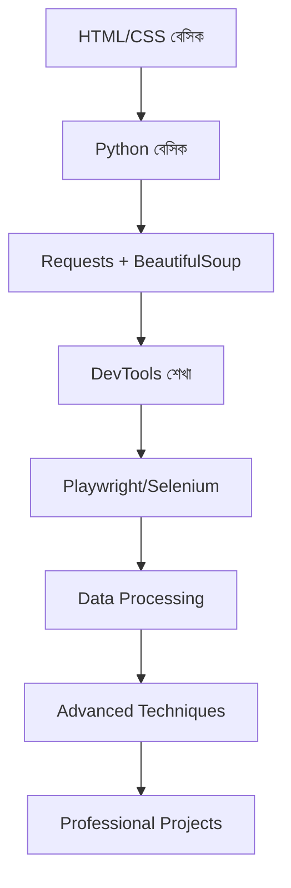

# 🎭 Playwright দিয়ে ওয়েব স্ক্র্যাপিং - সম্পূর্ণ বাংলা গাইড

> **শিশু থেকে এক্সপার্ট লেভেল পর্যন্ত Playwright দিয়ে ওয়েব স্ক্র্যাপিং - বাংলায়!**

[](https://python.org)
[](https://playwright.dev)

## 🎯 এই গাইড কার জন্য?

- 🧒 **শিশু/নতুন শিক্ষার্থী:** যারা প্রোগ্রামিং জানেন না
- 🥉 **বিগিনার:** যারা Python জানেন কিন্তু Playwright জানেন না
- 🥈 **ইন্টারমিডিয়েট:** যারা বেসিক scraping জানেন
- 🥇 **অ্যাডভান্স:** যারা প্রফেশনাল লেভেলে কাজ করতে চান

## 🎭 কেন Playwright?

### ✅ **Playwright এর সুবিধা:**
- **🚀 Fast & Reliable:** অন্যান্য tools থেকে দ্রুত
- **🌐 Multi-Browser:** Chrome, Firefox, Safari support
- **📱 Mobile Support:** iOS/Android emulation
- **🔧 Network Control:** Request/Response intercept
- **📸 Screenshot/PDF:** Page capture
- **🤖 JavaScript Rendering:** Dynamic content handle

### ❌ **অন্যান্য Tools এর সমস্যা:**
- **Requests + BeautifulSoup:** JavaScript render করে না
- **Selenium:** ধীর এবং unstable
- **Puppeteer:** শুধু Chrome support

## 📚 কি কি শিখবেন?

### 🎯 **Core Playwright Skills:**
- ✅ Browser automation ও page control
- ✅ Element selection ও interaction
- ✅ JavaScript execution ও evaluation
- ✅ Request/Response interception
- ✅ Mobile device emulation
- ✅ Screenshot ও PDF generation

### 🔧 **Advanced Techniques:**
- ✅ Infinite scroll handling
- ✅ SPA (Single Page App) scraping
- ✅ Authentication ও session management
- ✅ CAPTCHA handling strategies
- ✅ Performance optimization
- ✅ Error handling ও debugging

## 🚀 দ্রুত শুরু করুন

### 1️⃣ ইনস্টলেশন:
```bash
# Playwright install করুন
pip install playwright

# Browser binaries install করুন (গুরুত্বপূর্ণ!)
playwright install
```

### 2️⃣ প্রথম Playwright কোড:
```python
from playwright.sync_api import sync_playwright

with sync_playwright() as p:
    # Browser launch করুন
    browser = p.chromium.launch(headless=False)
    page = browser.new_page()

    # Website এ যান
    page.goto("https://quotes.toscrape.com")

    # Data extract করুন
    quotes = page.locator('.quote').all()
    for quote in quotes:
        text = quote.locator('.text').text_content()
        author = quote.locator('.author').text_content()
        print(f'"{text}" - {author}')

    browser.close()
```

## 🌟 সম্পূর্ণ Feature List

### 🎭 **Playwright Mastery:**
- ✅ Browser automation (Chrome, Firefox, Safari)
- ✅ Mobile device emulation
- ✅ JavaScript rendering ও execution
- ✅ Network request interception
- ✅ Screenshot ও PDF generation
- ✅ Cookie ও session management
- ✅ Authentication handling
- ✅ CAPTCHA strategies

### 🛠️ **Utility Tools:**
- ✅ Image to PDF converter (batch processing)
- ✅ Very fast media downloader (async)
- ✅ QR code generator ও reader
- ✅ Image generation (gradients, patterns, AI)
- ✅ Form automation (multi-step)
- ✅ File processing utilities
- ✅ Data cleaning ও analysis

### 🔌 **Integration & Automation:**
- ✅ REST API client (with caching)
- ✅ Webhook server ও handling
- ✅ Multi-channel notifications
- ✅ Task scheduling system
- ✅ Error handling ও logging
- ✅ Database operations
- ✅ Email automation

### 📊 **Data Processing:**
- ✅ CSV/Excel processing
- ✅ JSON manipulation
- ✅ Statistical analysis
- ✅ Data visualization
- ✅ Machine learning integration
- ✅ Database management

## 📖 সম্পূর্ণ ডকুমেন্টেশন

### 🇧🇩 **বাংলা ডকুমেন্টেশন (Complete Bangla Docs):**
| ফাইল | বর্ণনা | লেভেল | লাইন |
|-------|---------|--------|------|
| 🏠 [**বাংলা হোম**](./bangla/README.md) | **Complete Bangla documentation hub** | সব লেভেল | 300+ |
| 🚀 [**দ্রুত শুরু**](./bangla/দ্রুত-শুরু.md) | **৫ মিনিটে setup ও first script** | নতুন | 300+ |
| 📚 [**শেখার গাইড**](./bangla/শেখার-গাইড.md) | **দ্রুত শেখার জন্য** | নতুন | 300+ |
| ⚡ [**দ্রুত রেফারেন্স**](./bangla/দ্রুত-রেফারেন্স.md) | **Cheat sheet ও commands** | সব লেভেল | 300+ |
| 📦 [**মডিউল গাইড**](./bangla/মডিউল-ইনস্টলেশন-গাইড.md) | **Module installation ও usage** | সব লেভেল | 300+ |
| 📄 [**সম্পূর্ণ গাইড**](./bangla/সম্পূর্ণ-playwright-গাইড.md) | **A-Z Playwright টিউটোরিয়াল** | সব লেভেল | 700+ |

### 🎭 Core Playwright Guides (English):
| ফাইল | বর্ণনা | লেভেল |
|-------|---------|--------|
| 📄 [**মূল গাইড**](./complete-bangla-guide.md) | **A-Z সম্পূর্ণ Playwright টিউটোরিয়াল** | সব লেভেল |
| 🚀 [**অ্যাডভান্স টেকনিক**](./playwright-advanced-techniques.md) | **Advanced scraping techniques** | ইন্টারমিডিয়েট+ |
| 🌟 [**Real-World Examples**](./playwright-real-world-examples.md) | **বাস্তব প্রজেক্ট উদাহরণ** | সব লেভেল |
| 🍪 [**Cookies ও Sessions**](./cookies-session-management.md) | **Cookie management ও authentication** | ইন্টারমিডিয়েট |
| 📦 [**Modules ও Requirements**](./modules-requirements-guide.md) | **Complete module installation ও usage** | সব লেভেল |
| ⚡ [**কুইক রেফারেন্স**](./quick-reference.md) | **চিট শিট এবং commands** | সব লেভেল |
| 📚 [**বেসিক গাইড**](./learn.md) | **দ্রুত শেখার জন্য** | বিগিনার |

### 🛠️ Utility & Processing Guides:
| ফাইল | বর্ণনা | লেভেল |
|-------|---------|--------|
| 🖼️ [**Image to PDF**](./image-to-pdf-converter.md) | **Image থেকে PDF তৈরি** | বিগিনার |
| 🎬 [**Media Downloader**](./playwright-media-downloader.md) | **Very fast image/video download** | ইন্টারমিডিয়েট |
| 🎨 [**QR ও Image Generator**](./qr-and-image-generator.md) | **QR code ও image generation** | বিগিনার |
| 🤖 [**Web Automation**](./web-automation-toolkit.md) | **Complete automation toolkit** | ইন্টারমিডিয়েট+ |
| 📊 [**Data Processing**](./data-processing-analysis.md) | **Data analysis ও visualization** | ইন্টারমিডিয়েট+ |
| 🔌 [**API Integration**](./api-integration-utilities.md) | **API, webhooks, notifications** | অ্যাডভান্স |

### ২. প্রথম স্ক্র্যাপিং কোড:
```python
import requests
from bs4 import BeautifulSoup

# সিম্পল স্ক্র্যাপিং
url = "https://quotes.toscrape.com/"
response = requests.get(url)
soup = BeautifulSoup(response.content, 'html.parser')

# সব quotes সংগ্রহ
quotes = soup.find_all('div', class_='quote')
for quote in quotes:
    text = quote.find('span', class_='text').text
    author = quote.find('small', class_='author').text
    print(f'"{text}" - {author}')
```

### ৩. Playwright দিয়ে অ্যাডভান্স স্ক্র্যাপিং:
```python
from playwright.sync_api import sync_playwright

with sync_playwright() as p:
    browser = p.chromium.launch(headless=False)
    page = browser.new_page()
    
    page.goto("https://example.com")
    page.wait_for_load_state("networkidle")
    
    # Element থেকে text নেওয়া
    title = page.locator("h1").text_content()
    print(f"Title: {title}")
    
    browser.close()
```

## 🎯 প্র্যাক্টিক্যাল প্রজেক্ট আইডিয়া

### 🥉 বিগিনার প্রজেক্ট:
- [ ] **Quote Scraper:** quotes.toscrape.com থেকে quotes সংগ্রহ
- [ ] **Weather Data:** আবহাওয়ার তথ্য সংগ্রহ
- [ ] **News Headlines:** সংবাদের শিরোনাম সংগ্রহ

### 🥈 ইন্টারমিডিয়েট প্রজেক্ট:
- [ ] **E-commerce Price Monitor:** পণ্যের দাম ট্র্যাক করা
- [ ] **Job Listings Aggregator:** চাকরির বিজ্ঞাপন সংগ্রহ
- [ ] **Social Media Analytics:** সোশ্যাল মিডিয়া ডেটা বিশ্লেষণ

### 🥇 অ্যাডভান্স প্রজেক্ট:
- [ ] **Real Estate Monitor:** রিয়েল এস্টেট দাম ট্র্যাকিং
- [ ] **Stock Market Data:** শেয়ার বাজারের তথ্য
- [ ] **Review Sentiment Analysis:** রিভিউ বিশ্লেষণ

## 🔗 দরকারী লিংক

### 📚 ডকুমেন্টেশন:
- [Requests](https://docs.python-requests.org/)
- [BeautifulSoup](https://www.crummy.com/software/BeautifulSoup/bs4/doc/)
- [Playwright](https://playwright.dev/python/)
- [Pandas](https://pandas.pydata.org/docs/)

### 🎥 ভিডিও টিউটোরিয়াল:
- [Python Web Scraping Playlist](https://youtube.com/playlist?list=PLzMcBGfZo4-lSq2IDrA6vpZEV92AmQfJK)
- [Playwright Tutorial](https://youtube.com/watch?v=yp1o9biMMWU)

### 💬 কমিউনিটি:
- [Reddit r/webscraping](https://reddit.com/r/webscraping)
- [Stack Overflow](https://stackoverflow.com/questions/tagged/web-scraping)

## ⚖️ আইনি সতর্কতা

### ✅ করতে পারেন:
- Public data সংগ্রহ
- Personal research
- robots.txt মেনে চলা
- Reasonable rate limiting

### ❌ করবেন না:
- Copyright content চুরি
- Personal information সংগ্রহ
- Server overload করা
- Terms of Service লঙ্ঘন

## 🤝 অবদান রাখুন

এই প্রজেক্টে অবদান রাখতে চাইলে:
1. Fork করুন
2. নতুন feature/example যোগ করুন
3. Pull request পাঠান

## 📞 সাহায্য প্রয়োজন?

- **Issues:** GitHub এ issue তৈরি করুন
- **Questions:** Discussion section ব্যবহার করুন
- **Bugs:** Bug report করুন

---

## 🎓 শেখার পথ



## 🚀 Quick Navigation

### 🎯 **শুরু করুন:**
1. [**Playwright Setup**](./complete-bangla-guide.md#setup) - প্রথমে এটি পড়ুন
2. [**Basic Examples**](./learn.md) - সহজ উদাহরণ দিয়ে শুরু
3. [**Cookie Management**](./cookies-session-management.md) - Login handling

### 🛠️ **Utilities:**
- [**Image to PDF**](./image-to-pdf-converter.md) - ছবি থেকে PDF
- [**Media Download**](./playwright-media-downloader.md) - দ্রুত download
- [**QR Generator**](./qr-and-image-generator.md) - QR code তৈরি

### 🔧 **Advanced:**
- [**Web Automation**](./web-automation-toolkit.md) - Complete automation
- [**Data Processing**](./data-processing-analysis.md) - Data analysis
- [**API Integration**](./api-integration-utilities.md) - API ও webhooks

### 📚 **Reference:**
- [**Advanced Techniques**](./playwright-advanced-techniques.md) - Pro tips
- [**Real Examples**](./playwright-real-world-examples.md) - বাস্তব প্রজেক্ট
- [**Quick Reference**](./quick-reference.md) - Cheat sheet

---

## 🎉 সমাপনী

এই comprehensive guide দিয়ে আপনি:
- **Playwright mastery** অর্জন করবেন
- **Professional web scraping** শিখবেন
- **Complete automation** তৈরি করতে পারবেন
- **Data processing** ও **API integration** করতে পারবেন

### 🤝 Community:
- Issues ও questions এর জন্য GitHub Issues ব্যবহার করুন
- নতুন features suggest করুন
- Documentation improve করতে contribute করুন

**শুভ স্ক্র্যাপিং! 🎭🇧🇩**

---

*সর্বশেষ আপডেট: ২০২৫ | Total Docs: 10+ | Total Examples: 100+*
